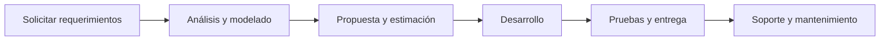

# 📝 Apuntes Primera Clase (02/03/2026)

## 📚 Trabajo pasado
El docente solicitó que elaboráramos un **título de proyecto** para revisión y corrección. A continuación se listan los ejemplos compartidos en clase:

1. Desarrollo de un sistema de información web informativo sobre los servicios médicos y administrativos del seguro social universitario
2. Implementación de un sistema de información para la automatización de registro de ventas y control de despachos de la empresa de transporte mediante el enfoque UML
3. Implementación para un sistema de información para la gestión de seguimientos de alumnos en el centro de entrenamiento de "Team Espartanos"
4. Desarrollo de un sistema de información para la gestión de miembros y control de cuotas del club deportivo "Falcons Escuela de Baloncesto"
5. Implementación de un sistema de información web para la gestión de clientes, pagos y control de asistencias en el gimnasio "Águilas", mediante UML

> 🗒️ **Nota**: el proyecto deberá desarrollarse como un **sistema de información web** durante esta materia.

---

## 🎯 Puntos clave recalcados por el docente

- **Simplicidad**: no se debe complicar con un proyecto demasiado grande; el objetivo es terminarlo.
- **Enfoque web**: el sistema será web (aunque la materia no impide otro tipo, se espera la mayoría sea web).
- **Herramientas en el título**: si se menciona UML u otra herramienta, también deben incluirse las demás tecnologías a emplear. UML solo forma parte del diseño.
- **Bajas vs eliminación**: en una base de datos no se borra un registro, se da de baja. Eliminar puede causar pérdida de datos relacionados y problemas si el usuario regresa.

> ⚠️ **Práctica insegura**: borrar directamente filas de tablas suele considerarse mala práctica por razón de integridad referencial y auditoría.

- El título del proyecto define el **alcance** y debe ser lo más específico posible, incluso mencionando la ciudad.
- Un sistema de información **ayuda a la toma de decisiones**.
- Comunicar claramente con el cliente: dominios, servidores, licencias, presupuesto, etc. Evita sorpresas y malentendidos.

> ✅ Consejo extra: prepara un breve glosario para el cliente con términos técnicos usados en el proyecto.

---

## 🧠 Consejos para formular el título

1. Comienza con:
   - **Implementación de un sistema de información** (añade "web" si aplica).
2. Describe brevemente el **problema o funcionalidad** que busca solucionar.
3. Indica el **lugar o institución** beneficiada.
4. Añade **ciudad/región** si aplica.

tabla de estructura de título:

| Parte | Ejemplo | Observación |
|-------|---------|-------------|
| Tipo | Implementación de un sistema de información web | No usar palabras genéricas como "automatiza" en el título |
| Objetivo | para la gestión de clientes, pagos y control de asistencias | Sea conciso y específico |
| Lugar | en el gimnasio "Águilas" | Nombre real o genérico si es confidencial |
| Ubicación | para la ciudad de Camiri | Añadir si el alcance es geográfico |

> ✏️ **Ejemplo antes / después:**

*Antes*: Implementación de un sistema de información web para la gestión de clientes, pagos y control de asistencias en el gimnasio "Águilas", mediante UML

*Después*: Implementación de un sistema de información web para la gestión de clientes, pagos y control de asistencias en el gimnasio "Águilas" para la ciudad de Camiri

---

## 💡 Recomendaciones adicionales

- No incluyas palabras como "automatiza" en el título: un sistema de información **ya implica automatización**.
- El objetivo de la materia es **modelar un sistema real**, diseñarlo e implementar una versión funcional.
- Mantén una comunicación transparente con el cliente: explica dominios, servidores, costos y funciones del sistema.
- Documenta los supuestos y requisitos iniciales en un acta de reunión.
- Justifica cada herramienta mencionada: ¿por qué usarás MySQL y no SQLite? ¿Por qué React en vez de vanilla JS?

> 📌 Tip: crea una checklist de requisitos y alcances para evitar cambios de alcance (scope creep).

---

## 🗂 Ejemplo visual: flujo básico de comunicación con el cliente

*(Puedes reemplazar este diagrama con una imagen real si prefieres.)*

---

## 📎 Consejos de estilo para los apuntes

- Usa encabezados claros y consistentes (`##` para secciones principales).
- Emplea listas numeradas o con viñetas para pasos o elementos relacionados.
- Agrega tablas para comparar conceptos o mostrar estructuras.
- Inserta diagramas Mermaid (como el anterior) para esquemas o flechas.
- Incluye ejemplos prácticos y notas de "código" entre backticks cuando correspondan.
- Conserva siempre la fecha de la clase al inicio para orden cronológico.

---

¡Con esta plantilla tus apuntes quedarán legibles, dinámicos y útiles tanto para estudiar como para consultar más adelante! Si necesitas ayuda con otro archivo o diagrama, házmelo saber.

