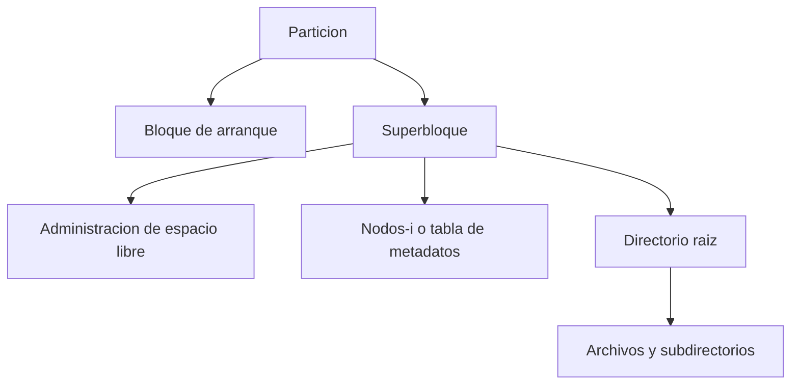

# Implementacion de Sistemas de Archivos

## Contenido
1. Tareas iniciales del sistema de archivos al recibir una particion
2. Organizacion interna del sistema de archivos
3. Implementacion de archivos (metodos de asignacion)
4. Implementacion de directorios
5. Archivos compartidos
6. Administracion de espacio en disco
7. Fiabilidad, consistencia y desempeno

---

## 1) Tareas iniciales del S.A. al asignar una unidad

Esta seccion integra las preguntas y observaciones dictadas en clase.

### Primera tarea: dividir la particion en bloques

- El sistema de archivos divide toda la particion en bloques pequenos de igual tamano.
- Objetivo: mejorar la eficiencia de transferencia entre memoria y disco.
- En disco duro, la unidad fisica minima es el sector (tipicamente 512 bytes).
- Para el sistema de archivos, la unidad logica minima de trabajo es el bloque.

Formula general:

$$
  ext{Cantidad de bloques} = \frac{\text{Tamano de la particion}}{\text{Tamano del bloque}}
$$

No se puede dar una cantidad fija sin conocer esos dos valores.

### Segunda tarea: dar formato (formatear)

- Formatear significa definir la estructura logica del S.A. en la particion.
- No es sinonimo de borrar, pero su efecto practico suele eliminar referencias a los datos previos.

Componentes tipicos despues del formato:

- Bloque de arranque
- Superbloque
- Estructura de administracion de espacio libre
- Estructura de metadatos (por ejemplo, nodos-i)
- Directorio raiz

### Tercera tarea: administrar asignacion de bloques a archivos

- Esta es la tarea central de la implementacion de archivos.
- El S.A. debe registrar que bloques pertenecen a cada archivo.

---

## 2) Organizacion del sistema de archivos

Cada particion puede tener su propio sistema de archivos, con estructuras internas definidas.

Diagrama general (vista logica):



Resumen de componentes:

- Superbloque: parametros globales del S.A. (tamano de bloque, cantidad de bloques, etc.).
- Estructura de libres: mapa de bits o lista enlazada.
- Nodos-i: atributos y direcciones de bloques de cada archivo.
- Directorio raiz: punto inicial del arbol de directorios.

---

## 3) Implementacion de archivos

Para guardar un archivo, el S.A. debe decidir como asignar bloques.

### a) Asignacion contigua

- Asigna bloques consecutivos para cada archivo.
- Solo necesita 2 datos por archivo:
  - bloque inicial
  - cantidad de bloques

Ejemplo de tabla:

| Archivo | Inicio | Tamano (bloques) |
|---|---:|---:|
| A | 1 | 4 |
| B | 5 | 3 |
| C | 8 | 5 |

Ventajas:

- Implementacion simple
- Excelente lectura secuencial
- Muy buen tiempo de acceso por cercania fisica

Desventaja principal:

- Fragmentacion externa (espacios libres intercalados que pueden no servir para archivos grandes)

Nota de clase:

- Se suele considerar mas viable en medios de solo lectura o crecimiento poco dinamico (por ejemplo CD/DVD), porque el crecimiento de archivos complica la contiguedad.

### b) Asignacion por lista enlazada

- Cada bloque contiene datos y un puntero al siguiente bloque del archivo.
- Los bloques no necesitan estar juntos.
- El directorio guarda solo el primer bloque (y a veces el ultimo para acelerar append).

Esquema de un bloque como nodo:

```text
+---------------------+
| datos | puntero sig |
+---------------------+
```

Diagrama de encadenamiento:


Ventajas:

- Usa bloques libres dispersos
- Menor problema de fragmentacion externa
- Requiere menos informacion inicial (basta conocer el primer bloque)

Desventajas:

- Sin acceso aleatorio eficiente: para llegar al bloque n hay que recorrer n-1
- Parte del bloque se consume en punteros
- El tamano util por bloque ya no es potencia exacta de 2 si se reserva bytes para el enlace

### c) Lista enlazada con tabla en memoria (estilo FAT)

- Los enlaces entre bloques se guardan en una tabla en memoria.
- Mejora la navegacion de la cadena de bloques, pero la tabla completa debe poder cargarse.

### d) Asignacion indexada con nodos-i

- Cada archivo tiene un nodo-i con atributos y direcciones de bloques.
- Puede combinar punteros directos e indirectos.

Ventajas:

- Buen equilibrio entre acceso secuencial y acceso directo
- Solo se cargan en memoria nodos-i de archivos abiertos

---

## 4) Implementacion de directorios

Funcion principal:

- Asociar nombre de archivo con la informacion necesaria para encontrar sus bloques.

Alternativas comunes:

- Guardar atributos en la entrada de directorio
- Guardar atributos en el nodo-i y dejar en directorio solo nombre + referencia

Operacion tipica de apertura:

1. Resolver ruta en directorios.
2. Obtener referencia a nodo-i o estructura equivalente.
3. Cargar metadatos y ubicacion de bloques.

---

## 5) Archivos compartidos

Cuando varios usuarios o procesos comparten archivos, se necesita:

- Control de permisos
- Control de concurrencia (bloqueos)
- Politicas de consistencia cuando hay escrituras simultaneas

Este punto puede ampliarse con ejemplos del sistema visto en laboratorio o en clase.

---

## 6) Administracion de espacio en disco

### Estrategias generales

1. Reservar n bytes consecutivos por archivo.
2. Usar bloques de tamano fijo (estrategia dominante en S.O. modernos).

### Tamano de bloque: compromiso de diseno

- Bloque grande: menos metadatos y menos operaciones de E/S, pero mas fragmentacion interna.
- Bloque pequeno: menos desperdicio interno, pero mas operaciones y mas metadatos.

### Registro de bloques libres

- Lista enlazada de bloques libres
- Mapa de bits (1 bit por bloque)

Diagrama conceptual de bitmap:

```text
Bloques:  0 1 2 3 4 5 6 7
Bitmap :  1 0 0 1 1 0 1 0
          L O O L L O L O
L = libre, O = ocupado
```

---

## 7) Fiabilidad, consistencia y desempeno

### Fiabilidad

- Realizar respaldos periodicos.
- Gestionar bloques defectuosos (marcarlos y excluirlos de la lista de libres).

### Consistencia

Un fallo durante actualizaciones puede dejar inconsistencias entre:

- nodos-i
- directorios
- estructura de bloques libres

Chequeos tipicos detectan casos como:

| Problema | Efecto | Accion de recuperacion |
|---|---|---|
| Bloque en ninguna tabla | Bloque perdido | Pasarlo a libres |
| Bloque repetido en libres | Error de estructura | Depurar libres |
| Bloque repetido en usados | Corrupcion entre archivos | Reasignar y reparar referencias |
| Bloque libre y usado a la vez | Inconsistencia critica | Quitar de libres |

### Desempeno

- El disco es mucho mas lento que la RAM.
- Por eso se usa cache de bloques (buffer cache) para reducir accesos fisicos.

---

## Resumen rapido de clase

1. La particion se divide en bloques.
2. Se da formato con estructuras logicas del S.A.
3. Se administra que bloques pertenecen a cada archivo.
4. El metodo de asignacion define rendimiento, uso de espacio y complejidad.

