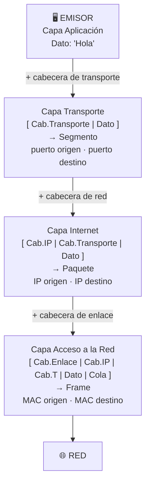
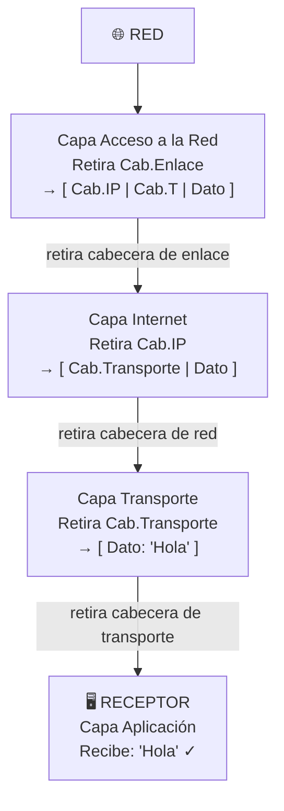
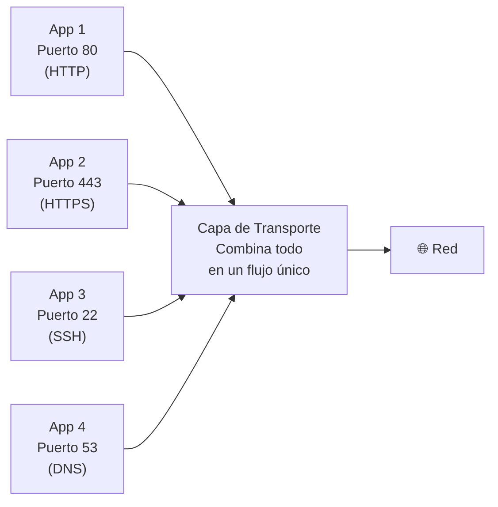
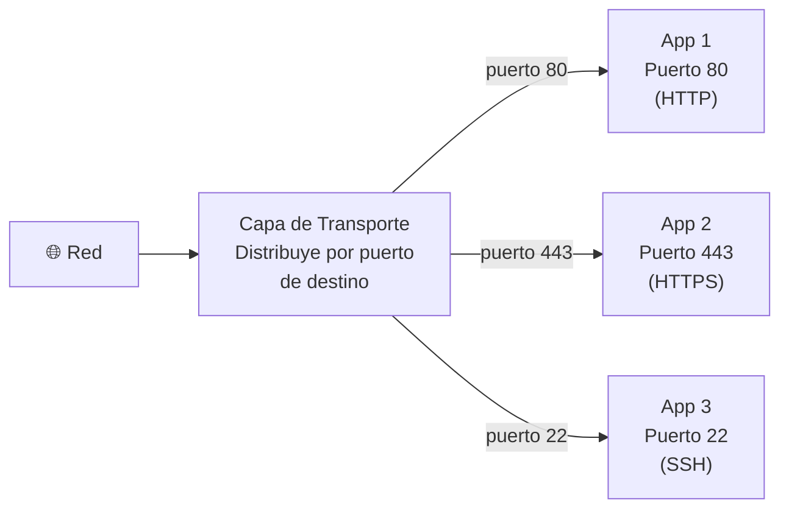

### Pasos para instalar Windows Server 2012 en VMware Workstation

1. Descargar la ISO de Windows Server 2012 (disponible en MSDN o el sitio oficial de Microsoft).
2. Abrir VMware Workstation y hacer clic en **"Create a New Virtual Machine"**.
3. Seleccionar **"Typical (recommended)"** y hacer clic en **Next**.
4. Elegir **"Installer disc image file (iso)"** y seleccionar la ISO descargada.
5. Asignar un nombre a la VM y la ubicación donde se guardará.
6. Definir el tamaño del disco (mínimo recomendado: 40 GB) y hacer clic en **Next**.
7. Hacer clic en **"Customize Hardware"**: asignar al menos 2 GB de RAM y 1 procesador.
8. Hacer clic en **Finish** y luego en **"Power On this virtual machine"**.
9. En el instalador: elegir idioma → **"Instalación personalizada"** → seleccionar la partición de disco.
10. Esperar que termine la instalación y establecer la contraseña del Administrador.

### Pasos para instalar Windows Server 2012 en VirtualBox

1. Descargar la ISO de Windows Server 2012.
2. Abrir VirtualBox y hacer clic en **"Nueva"**.
3. Poner un nombre, tipo **"Microsoft Windows"**, versión **"Windows 2012 (64-bit)"** y hacer clic en **Siguiente**.
4. Asignar memoria RAM (mínimo recomendado: 2 GB).
5. Crear un disco duro virtual (tipo VDI, tamaño dinámico, mínimo 40 GB).
6. Con la VM creada, ir a **Configuración → Almacenamiento**, hacer clic en el ícono del disco vacío y cargar la ISO.
7. Iniciar la máquina y seguir el instalador: elegir idioma → **"Instalación personalizada"** → seleccionar partición.
8. Esperar que termine la instalación y establecer la contraseña del Administrador.

La finalidad de esto es que porque en esta materia nos vamos a dedicar a las capas de aplicacion y de transporte
## Modelo TCP/IP

| Capa | Qué hace | Protocolos |
|------|----------|------------|
| **4. Aplicación** | Genera y procesa los datos del usuario | HTTP, FTP, SMTP, DNS |
| **3. Transporte** | Divide los datos en segmentos y controla su entrega | TCP, UDP |
| **2. Internet** | Enruta los paquetes entre redes distintas usando IP | IP, ICMP |
| **1. Acceso a la Red** | Transmite los datos físicamente por cables o Wi-Fi | Ethernet, Wi-Fi (802.11) |

# Capa de Transporte

Las aplicaciones generan datos, que son enviados a la red y viajan por cada una de las capas. En cada capa, se agrega una **cabecera** (información de control) al dato — esto se llama **encapsulamiento**. Al llegar al destino, cada capa lee y retira su cabecera — esto se llama **desencapsulamiento**.

### Encapsulamiento (lado del emisor)

Imagina que mandas una carta: la doblas, la metes en un sobre, el sobre en una caja, y la caja en un camión. Cada "envoltura" lleva instrucciones para esa etapa del viaje. Así mismo funciona en las redes:

### Desencapsulamiento (lado del receptor)

En el destino el proceso es al revés: cada capa lee su cabecera, la retira y pasa el resto a la capa de arriba.

La capa de transporte viene a ser el intermedio para las aplicaciones
La aplicacion es el cliente que quiere enviar una encomienda por la empresa de transporte. El cliente no sabe cómo funciona la logística interna; solo lleva su paquete a la ventanilla y espera que llegue al destinatario.

- **El cliente** = La aplicación (por ejemplo, tu navegador o app de correo).
- **La ventanilla de la empresa** = La capa de transporte (punto de contacto entre la app y la red).
- **La encomienda** = Los datos que se quieren enviar.
- **La dirección del destinatario** = La dirección IP + puerto de destino (socket).
- **El número de guía** = El ID de conexión (identifica ese envío de forma única).
- **Tipo de envío elegido por el cliente**:
  - **Envío con acuse de recibo (certificado)** → **TCP**: la empresa confirma que el paquete llegó; si se pierde en el camino, lo reenvía.
  - **Envío express sin garantía** → **UDP**: más rápido y con menos trámites, pero si el paquete se pierde, nadie te avisa ni lo reenvía.

## Funciones
- **Primera función**: Actuar como intermediario entre las aplicaciones y la red, enviando los datos. Las aplicaciones utilizan la capa de transporte.
- **Segunda función**: Encargarse de procesos como el control de flujo y congestión.
- **Última función**: Asegurarse de que el mensaje llegue a su destino sin errores.

Al encargarse del servicio de transporte, hay dos opciones principales para enviar los datos, las aplicaciones eligen cuál opción van a usar:
1. **TCP** (Transmission Control Protocol)
2. **UDP** (User Datagram Protocol)

Estos se diferencian en la calidad del servicio.

### ¿Cómo se define la calidad en redes?
- **Equilibrar costo-beneficio**:
  - **Costo**: Cantidad de datos circulando por la red (overhead).
  - **Beneficio**: Certeza de que los datos lleguen correctamente, con total exito.

De estas opciones, una ofrece más calidad que la otra:
- Opción con calidad: Requiere más recursos, pero garantiza fiabilidad.
- Opción sin calidad: Envío rápido, pero sin garantías.

**TCP = Calidad (fiable)**; **UDP = No calidad (rápido)**.

## Primera Diferencia entre TCP y UDP

- **Protocolos orientados a conexión** → TCP:
  1. Establecer conexión entre origen y destino (handshake de tres vías).
  2. Supervisar la conexión en todo momento.
  3. Cerrar la conexión al finalizar.
  
  **Ejemplo**: Llamadas normales o de WhatsApp (requieren conexión estable).

- **Protocolos no orientados a conexión** → UDP:
  - Envío directo de mensajes sin establecer conexión.
  
  **Ejemplo**: Mensajes de texto tradicionales (SMS).

### Ventajas y Desventajas
- **TCP**:
  - Ventajas: Entrega fiable, ordenada y sin errores; control de flujo y congestión.
  - Desventajas: Mayor overhead, más lento.
- **UDP**:
  - Ventajas: Rápido, bajo overhead, ideal para tiempo real.
  - Desventajas: No garantiza entrega ni orden.

### Usos Comunes
- **TCP**: Navegación web (HTTP/HTTPS), FTP, SMTP.
- **UDP**: Streaming (video/audio), juegos, DNS.

## Puertos

Es un número de identificación (16 bits, de 0 a 65535). Las aplicaciones tienen un número de puerto, como 80 (origen) - 80 (destino), clave para recibir y enviar datos.

Además, las aplicaciones necesitan un **socket**, que es la combinación de DIRECCIÓN IP + NÚMERO DE PUERTO.

**Ejemplo**: 192.168.0.15:21 (5 números en total; sockets se usan para establecer conexiones).

### Rangos de Puertos
- **Bien conocidos (0-1023)**: Reservados (ej. 80: HTTP, 443: HTTPS).
- **Registrados (1024-49151)**: Aplicaciones específicas.
- **Dinámicos (49152-65535)**: Asignados por el SO.

## ID de Conexión

Número único formado por socket origen + socket destino:
 IP.PUERTO_ORIGEN + IP.PUERTO_DESTINO (10 números en total, 10 numeros forman la cadena de conexion ).

Un equipo puede tener múltiples conexiones simultáneas. Para manejar esto sin confusión, se usan multiplexación y desmultiplexación.

## 1. Multiplexación

Proceso donde la capa de transporte combina datos de múltiples aplicaciones en un flujo único hacia la red, identificando cada uno por puertos.

### Gráfico de Multiplexación

Esto permite compartir el canal de red eficientemente.

## 2. Desmultiplexación

Proceso inverso: la capa de transporte recibe el flujo de la red y lo distribuye a la aplicación correcta usando puertos.

### Gráfico de Desmultiplexación

Ejemplo: Un paquete llega con puerto destino 80, se dirige a la aplicación web.

## Otros Aspectos de la Capa de Transporte

### Control de Flujo
Evita que el emisor sobrecargue al receptor. En TCP, usa ventana deslizante.

### Control de Congestión
Gestiona congestión en la red (ej. algoritmo de Tahoe en TCP).

### Comparación con Otras Capas
- **Capa de Red**: Enrutamiento entre hosts.
- **Capa de Transporte**: Comunicación entre procesos.

### Errores y Recuperación
- TCP: Reenvía paquetes perdidos.
- UDP: No hay recuperación; depende de la aplicación.

Esta versión mejora la estructura, corrige errores gramaticales y añade gráficos detallados para mayor claridad.

