# 📡 DHCP (Dynamic Host Configuration Protocol)

## 📑 Tabla de Contenidos

1. [Conceptos Básicos](#conceptos-básicos)
2. [Beneficios](#beneficios)
3. [Procesos DHCP](#procesos-dhcp)
4. [Instalación y Configuración](#instalación-y-configuración)
5. [Comandos Importantes](#comandos-importantes)
6. [Administración DHCP](#administración-dhcp)
7. [Reservas de IP](#reservas-de-ip)

---

## Conceptos Básicos

**DHCP** (Dynamic Host Configuration Protocol) es un protocolo de nivel de aplicación que permite **asignar automáticamente direcciones IP y otros parámetros de red** a los dispositivos (clientes).

Se convirtió en un estándar porque facilita la administración de redes sin necesidad de configurar manualmente cada equipo.

### 🔄 Modelo de Trabajo

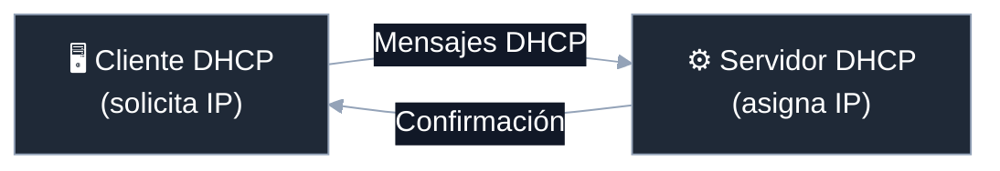

> 👉 **Importante:** Todo servicio DHCP necesita estos dos roles funcionando correctamente.

---

## Beneficios

```mermaid
%%{init: {"theme":"base","themeVariables":{"lineColor":"#94a3b8"}}}%%
graph TD
  R["Beneficios DHCP"]

  A["Asignación Automática"]
  A1["Sin intervención manual"]
  A2["Configurable"]

  B["Evita Errores"]
  B1["No hay configuraciones manuales incorrectas"]
  B2["Consistencia en la red"]

  C["Reduce Administración"]
  C1["Menos tiempo configurando"]
  C2["Gestión centralizada"]

  D["Reutilización de IPs"]
  D1["Mediante concesiones"]
  D2["Mejor aprovechamiento"]

  E["Facilita Conexiones"]
  E1["Dispositivos se conectan automáticamente"]
  E2["Plug and Play"]

  F["Evita Conflictos"]
  F1["No hay IPs duplicadas"]
  F2["Control automático"]

  R --> A
  A --> A1
  A --> A2

  R --> B
  B --> B1
  B --> B2

  R --> C
  C --> C1
  C --> C2

  R --> D
  D --> D1
  D --> D2

  R --> E
  E --> E1
  E --> E2

  R --> F
  F --> F1
  F --> F2

  classDef allnodes fill:#111827,stroke:#94a3b8,color:#ffffff;
  class R,A,A1,A2,B,B1,B2,C,C1,C2,D,D1,D2,E,E1,E2,F,F1,F2 allnodes;
```

---

## Procesos DHCP

### 📄 ¿Qué son las Concesiones?

DHCP funciona mediante **concesiones (leases)**, que son **contratos temporales de uso de una IP**. 

Esto permite:
- ✅ Reutilizar IPs cuando un dispositivo se desconecta
- ✅ Actualizar configuraciones automáticamente
- ✅ Optimizar el uso de direcciones disponibles

### 🔹 Tipos de Servicios DHCP

| Tipo | Descripción | Cuándo ocurre |
|------|-------------|----------------|
| 🆕 **Generación de Concesión** | Se asigna una nueva IP a un cliente | Primer conexión del dispositivo |
| 🔄 **Renovación de Concesión** | Se extiende el contrato de una IP | Antes que expire la concesión |

---

### 🔄 Proceso DORA (4 Pasos Principales)

El proceso de asignación de IP se conoce como **DORA**:

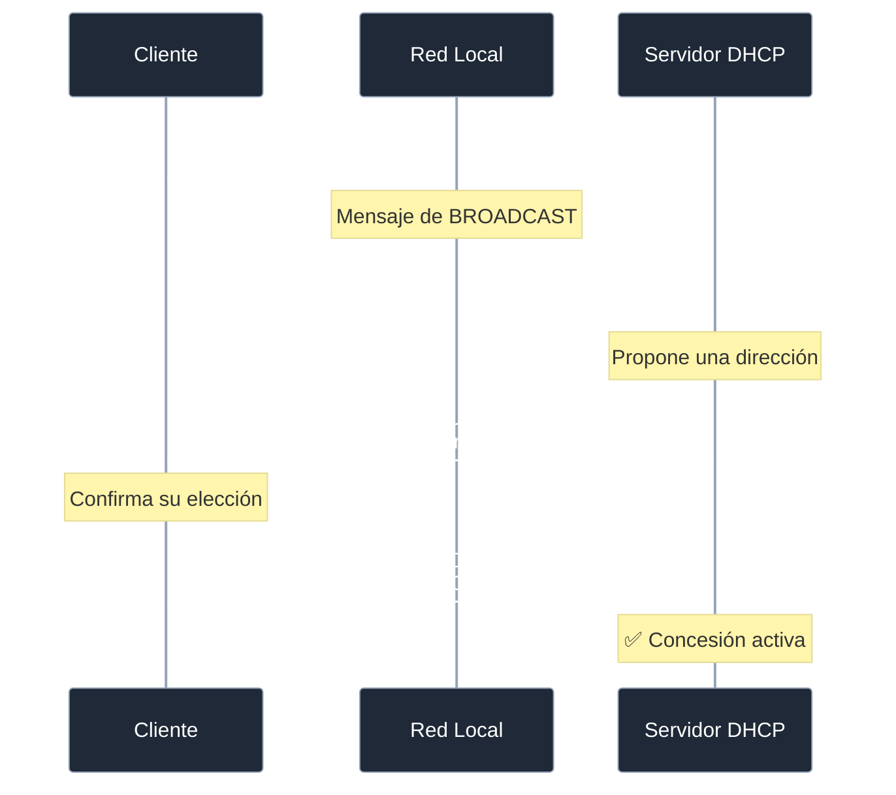

### 📊 Detalle de Cada Etapa

| Paso | Nombre | Actor | Qué Ocurre |
|------|--------|-------|-----------|
| 1️⃣ | **DISCOVER** | 🖥️ Cliente | Envía mensaje de difusión (broadcast) buscando servidores DHCP |
| 2️⃣ | **OFFER** | ⚙️ Servidor | Responde ofreciendo una dirección IP disponible |
| 3️⃣ | **REQUEST** | 🖥️ Cliente | Solicita usar la IP que le ofrecieron |
| 4️⃣ | **ACK** | ⚙️ Servidor | Confirma y asigna la IP oficialmente |

#### ❓ ¿Cómo se comunica el cliente sin IP?

El cliente utiliza **mensajes de difusión (broadcast)** para comunicarse en la red sin necesidad de una IP previa. Estos mensajes llegan a todos los dispositivos de la red local.

---

### 🔁 Proceso de Renovación

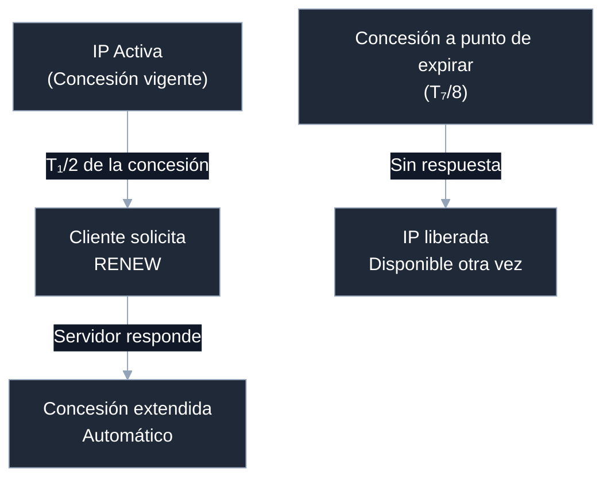

> 👉 **Este proceso es automático** y ocurre antes de que expire la concesión, durante el tiempo de vida de la IP.

---

## Instalación y Configuración

### 🖥️ Paso a Paso: Windows Server

#### ✅ Requisitos Iniciales

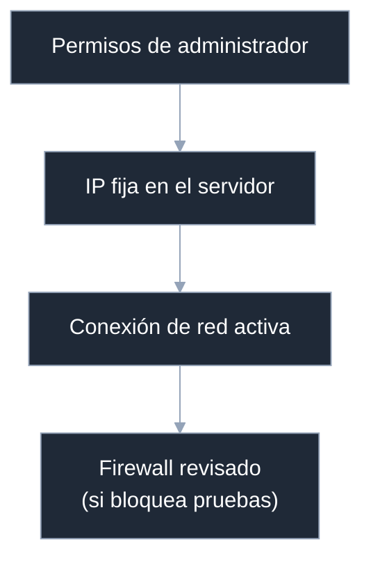

---

#### 1️⃣ Configurar IP Fija en el Servidor

```
🔹 Centro de redes y recursos compartidos
    ↓
🔹 Propiedades de red
    ↓
🔹 Seleccionar tarjeta Ethernet
    ↓
🔹 Asignar IP manual (Ej: 192.168.1.1)
```

**Ejemplo de configuración:**
- 📌 IP: `192.168.1.1`
- 📌 Máscara: `255.255.255.0`
- 📌 Gateway: `192.168.1.1` (el propio servidor)

---

#### 2️⃣ Verificar Conexión de Red

Abre **CMD** y ejecuta:

```bash
ipconfig          # Ver configuración actual
ipconfig /all      # Ver detalles completos
ping 192.168.1.X   # Probar conectividad
```

**Pruebas importantes:**

| Desde | Hacia | Resultado Esperado |
|-------|-------|-------------------|
| VM | Máquina Real | ✅ Reply from... |
| Máquina Real | VM | ✅ Reply from... |

#### ⚠️ Problemas Comunes

| Problema | Síntomas | Solución |
|----------|----------|----------|
| 🚫 Firewall bloquea | Timeout en ping | Panel de Control → Firewall → Permitir aplicación |
| 🚫 IP no responde | "Destination unreachable" | Verificar IP fija, revisar firewall |
| 🚫 No hay conexión | Tarjeta sin IP | Reiniciar tarjeta o servicio de red |

---

#### 3️⃣ Instalar el Rol DHCP

En **Administrador del Servidor**, sigue estos pasos:

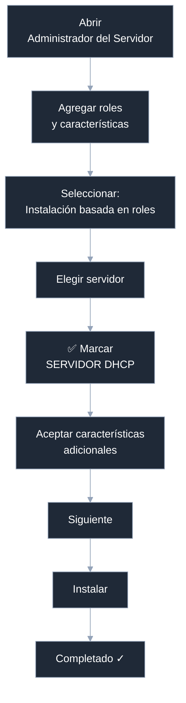

---

#### 4️⃣ Configurar el Ámbito DHCP

Una vez instalado, accede al DHCP:

```
Herramientas → DHCP
    ↓
DHCP → IPv4 → (expandir)
    ↓
Click derecho → Nuevo ámbito
```

**Configura estos datos:**

| Campo | Descripción | Ejemplo |
|-------|-------------|---------|
| 📝 **Nombre** | Identificador del ámbito | "Red Aula 01" |
| 🔢 **Rango de IPs** | Inicio y fin del rango | 192.168.1.100 - 192.168.1.200 |
| 🧮 **Máscara de subred** | Máscara de red | 255.255.255.0 |
| ❌ **Exclusiones** | IPs que NO se asignarán | 192.168.1.110 (servidor) |
| ⏱️ **Tiempo de concesión** | Duración del contrato | 8 días (estándar) |

**Para finalizar:**

```
Click derecho en el ámbito → Activar ✅
```

> **⚠️ El ámbito debe estar activado para que funcione.** Si no lo está, los clientes no podrán obtener IPs.

---

## Comandos Importantes

### 💻 Comandos IPCONFIG

| Comando | Función | Qué Muestra |
|---------|---------|------------|
| `ipconfig` | Ver info básica | IP actual, Gateway |
| `ipconfig /all` | Ver info completa | **IP, Servidor DHCP, Fecha de expiración** |
| `ipconfig /release` | Liberar IP actual | Suelta la concesión |
| `ipconfig /renew` | Renovar IP | Solicita nueva concesión |

### 🔍 Ver Información Detallada

```bash
ipconfig /all
```

**Información clave que se muestra:**

```
Configuración de IP:
├── Dirección IPv4: 192.168.1.105
├── Máscara de subred: 255.255.255.0
├── Puerta de enlace: 192.168.1.1
├── Servidores DHCP: 192.168.1.1
├── Dirección MAC: 00-1A-2B-3C-4D-5E
└── Duración de la concesión: 8 días
    ├── Obtenida: 2026-03-24 10:30:00
    └── Expira: 2026-04-01 10:30:00
```

### 📤 Liberar IP Actual

```bash
ipconfig /release
```

**Efectos:**
- ❌ La tarjeta queda sin dirección IP
- ❌ Se pierde conectividad
- ℹ️ La IP vuelve al pool disponible

### 🔄 Renovar IP

```bash
ipconfig /renew
```

**Qué ocurre:**
1. Cliente solicita renovación al servidor DHCP
2. Servidor busca IP disponible
3. Se asigna una nueva IP (puede ser la misma o diferente)
4. Se establece nueva concesión

---

## Administración DHCP

### 🛠️ Herramientas de Administración

Una vez instalado, accede desde:

```
Herramientas → DHCP
    ↓
DHCP → IPv4 → (Tu ámbito configurado)
```

### 📦 Conjunto de Direcciones (Address Pool)

Aquí visualizas:

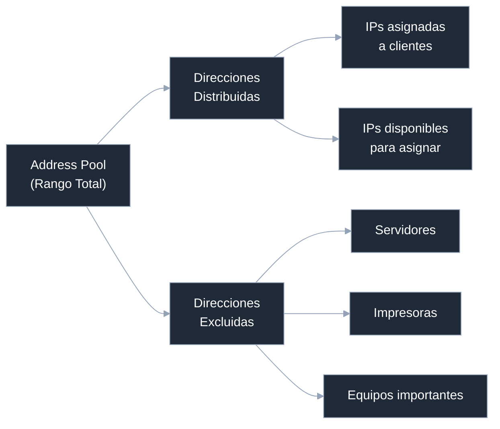

**Ejemplo:**
- Rango total: `192.168.1.100 - 192.168.1.200` (101 direcciones)
- Excluidas: `192.168.1.110` (para servidor)
- Disponibles: 100 direcciones

> 👉 Las exclusiones se usan cuando quieres reservar manualmente ciertas IPs (servidores, impresoras, etc.).

---

### 📄 Concesiones de Direcciones (Address Leases)

Aquí ves los contratos activos de clientes conectados:

| Cliente | IP Asignada | MAC | Estado | Expira |
|---------|-------------|-----|--------|--------|
| PC-Aula-01 | 192.168.1.105 | 00:1A:2B:3C:4D:5E | Activa | 2026-04-01 |
| Laptop-Prof | 192.168.1.106 | AA:BB:CC:DD:EE:FF | Activa | 2026-04-02 |
| Impresora | (Reservada) | 11:22:33:44:55:66 | Activa | ∞ |

**Desde aquí puedes:**

- ❌ **Eliminar una concesión** → El cliente perderá su IP y deberá solicitar una nueva
- 📊 **Monitorear clientes** → Ver qué dispositivos están conectados
- 🔍 **Buscar problemas** → Identificar clientes sin IP o concesiones expiradas

---

## Reservas de IP

### 📌 ¿Qué son las Reservas?

Las **reservas** permiten que un dispositivo siempre tenga **la misma dirección IP** asignada, aunque sea automáticamente por DHCP.

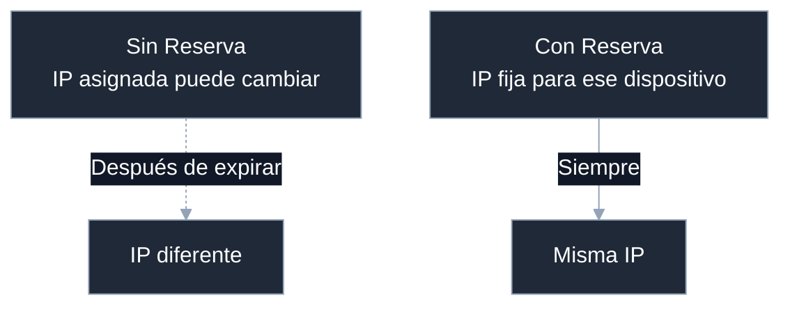

### 🎯 Casos de Uso

Las reservas son útiles para:

| Dispositivo | Razón | Ejemplo |
|-------------|-------|---------|
| 🖨️ **Impresoras** | IP fija en configuración | `192.168.1.110` |
| 🖥️ **Servidores** | Necesitan IP estable | `192.168.1.150` |
| 📹 **Cámaras IP** | Acceso remoto | `192.168.1.160` |
| 🔐 **Proxies** | Gestión centralizada | `192.168.1.200` |

---

### ✅ Requisitos para una Reserva

Para crear una reserva debes cumplir:

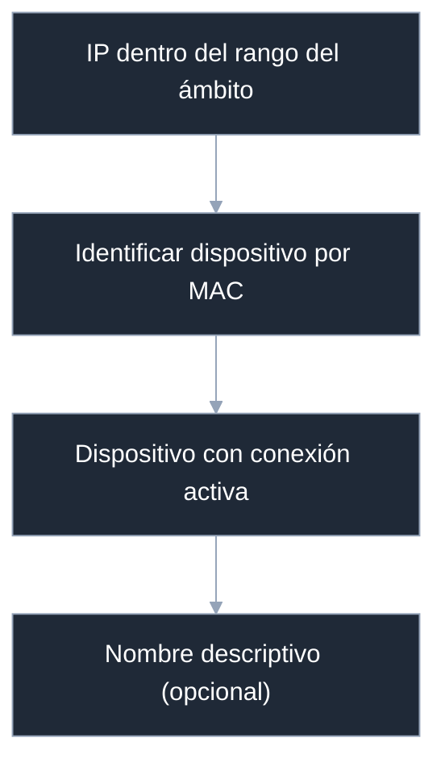

---

### 🧾 Datos Necesarios

Para crear una reserva necesitas **3 datos:**

| Dato | Qué es | Ejemplo |
|------|--------|---------|
| **IP** | Dirección a reservar | `192.168.1.110` |
| **MAC** | Dirección física única | `00-1A-2B-3C-4D-5E` |
| **Nombre** | Descripción (opcional) | "Impresora-Aula-01" |

---

### 🔍 Obtener la Dirección MAC

**Desde el cliente (Windows):**

```bash
ipconfig /all
```

Busca esta línea:
```
Dirección física (Physical Address): 00-1A-2B-3C-4D-5E
```

**Desde el cliente (Linux/Mac):**

```bash
ifconfig          # Linux
ipconfig getifaddr en0  # Mac
```

---

### 🔧 Crear una Reserva

En DHCP Manager:

```
DHCP → IPv4 → Ámbito → Reservas
    ↓
Click derecho → Nueva reserva
```

**Completa:**

```
Nombre de reserva:      Impresora-Aula-01
Dirección IP:           192.168.1.110
Dirección MAC:          00-1A-2B-3C-4D-5F
Descripción (opcional): Impresora láser Canon
Asociar con DHCP:       ✅ DHCP
```

---

### 📌 Ejemplo Práctico Completo

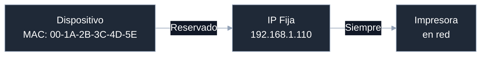

**Resultado:**
```
Si tienes:
  ✓ IP: 192.168.1.110
  ✓ MAC: 00-1A-2B-3C-4D-5E

👉 Esa IP SIEMPRE será asignada a ese dispositivo
   (aunque solicite renovación)
```

---

## 📚 Resumen General

```mermaid
%%{init: {"theme":"base","themeVariables":{"lineColor":"#94a3b8"}}}%%
graph TD
  R["DHCP"]

  C["Conceptos"]
  C1["Protocolo automático"]
  C2["Asigna IPs dinámicamente"]
  C3["Usa concesiones temporales"]

  P["Procesos"]
  P1["DORA (4 pasos)"]
  P2["Generación de concesión"]
  P3["Renovación automática"]

  I["Instalación"]
  I1["Configurar IP fija"]
  I2["Instalar rol DHCP"]
  I3["Crear ámbito"]
  I4["Activar servicio"]

  A["Administración"]
  A1["Ver concesiones"]
  A2["Exclusiones"]
  A3["Reservas de IP"]
  A4["Monitorear clientes"]

  M["Comandos"]
  M1["ipconfig"]
  M2["ipconfig /all"]
  M3["ipconfig /release"]
  M4["ipconfig /renew"]

  R --> C
  C --> C1
  C --> C2
  C --> C3

  R --> P
  P --> P1
  P --> P2
  P --> P3

  R --> I
  I --> I1
  I --> I2
  I --> I3
  I --> I4

  R --> A
  A --> A1
  A --> A2
  A --> A3
  A --> A4

  R --> M
  M --> M1
  M --> M2
  M --> M3
  M --> M4

  classDef allnodes fill:#111827,stroke:#94a3b8,color:#ffffff;
  class R,C,C1,C2,C3,P,P1,P2,P3,I,I1,I2,I3,I4,A,A1,A2,A3,A4,M,M1,M2,M3,M4 allnodes;

```

---

